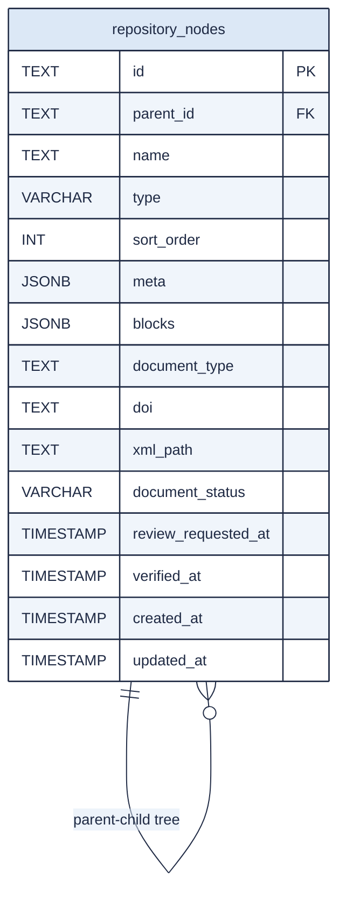

# Repository Pages DB ER Diagram

## Description

1. `repository_nodes` stores both directories and documents in one table.
2. `type` defines node kind: `directory` or `document`.
3. Tree hierarchy is implemented by self-reference: `parent_id -> repository_nodes.id`.
4. `sort_order` controls sibling ordering inside the same parent.
5. `meta` (`JSONB`) keeps document metadata such as annotation, authors, and workflow comments.
6. `blocks` (`JSONB`) stores document content blocks (text, image, link, file).
7. `document_type`, `doi`, and `xml_path` are document-specific publication fields.
8. `document_status` tracks workflow state: `needs_revision`, `under_review`, `verified`.
9. `review_requested_at` and `verified_at` record key workflow timestamps.
10. `created_at` and `updated_at` provide audit and chronological sorting fields.
